##### 介绍

基于插件方式实现动态可插拔式功能扩展，主要应用包括支付插件、注册、营销活动计算等。
定义抽象接口标记为扩展点，由插件扩展实现具体扩展点，实现插拔式扩展，增加其灵活性。

##### 测试

- 启动日志

  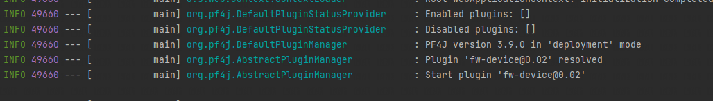

- 插件列表

  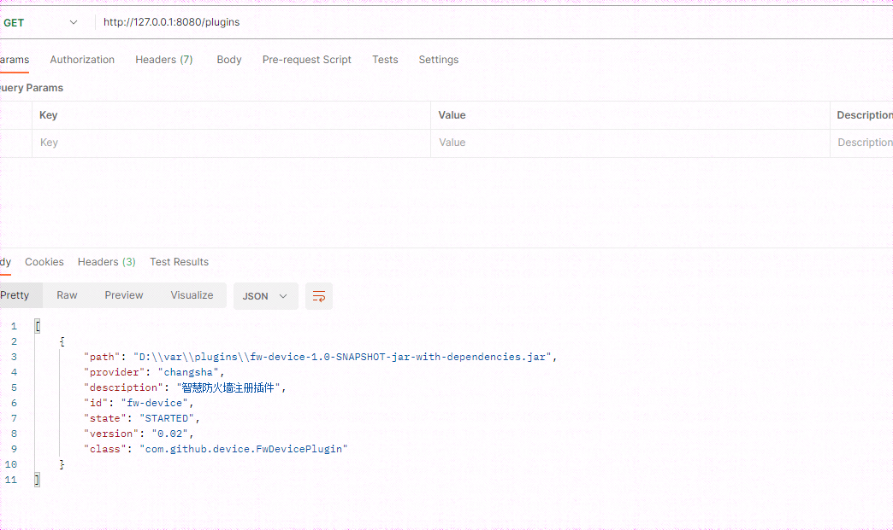

- 插件测试

  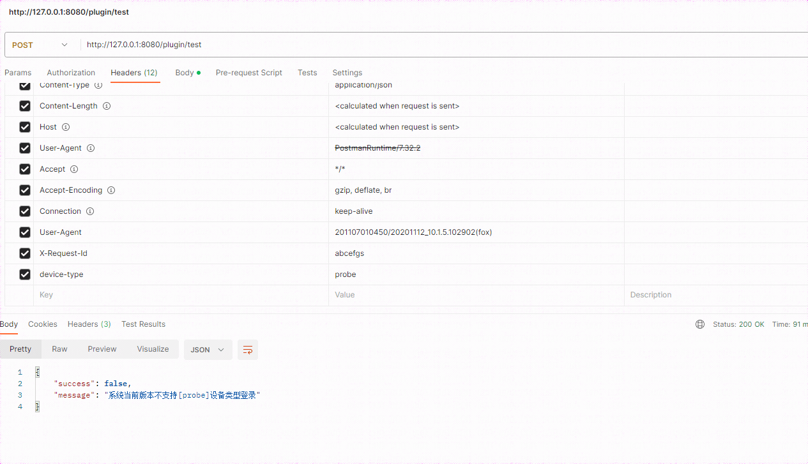
  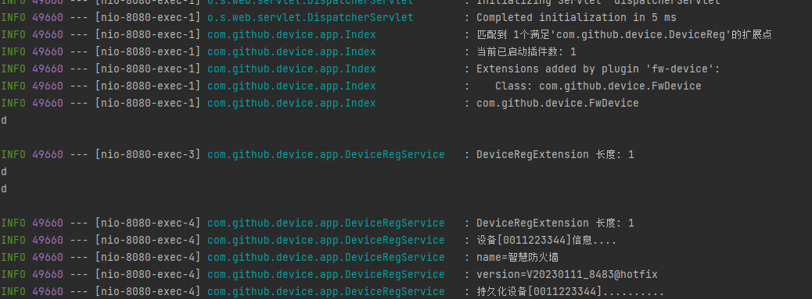

- 动态新增插件

  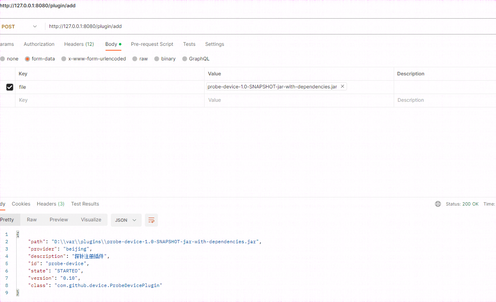
  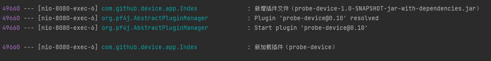
  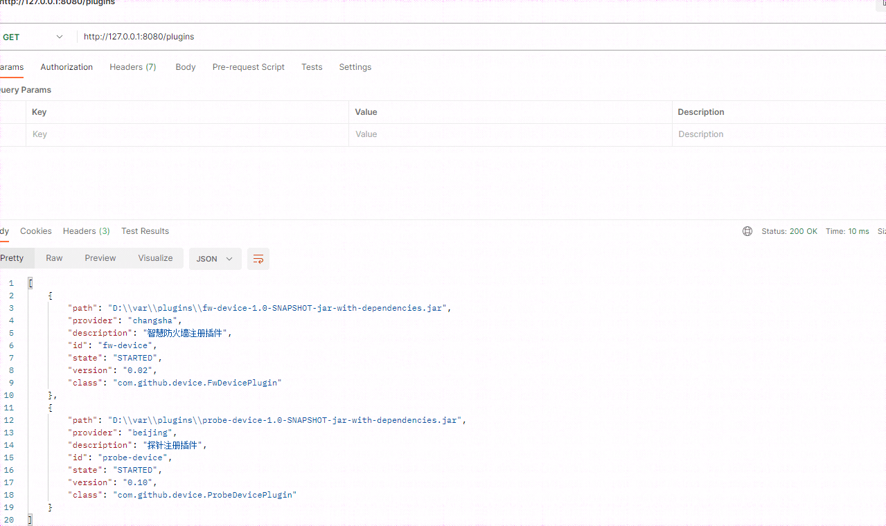

- 插件测试

  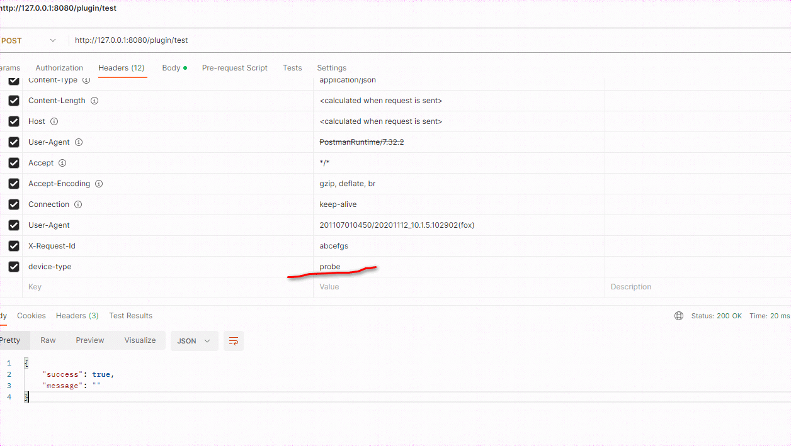
  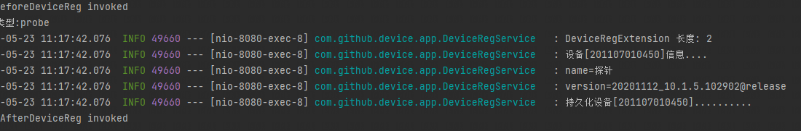

- 动态启停

  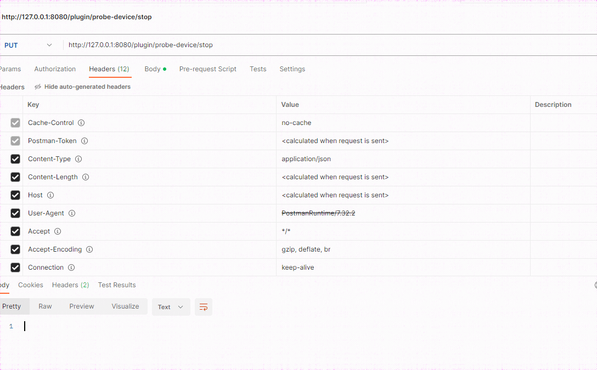
  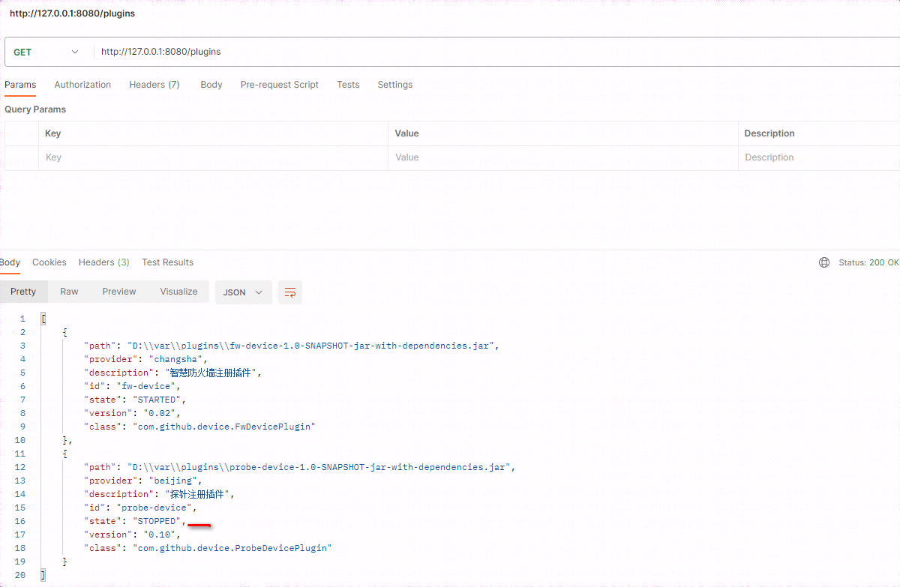
  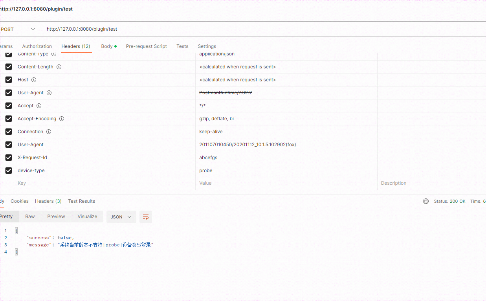
  
  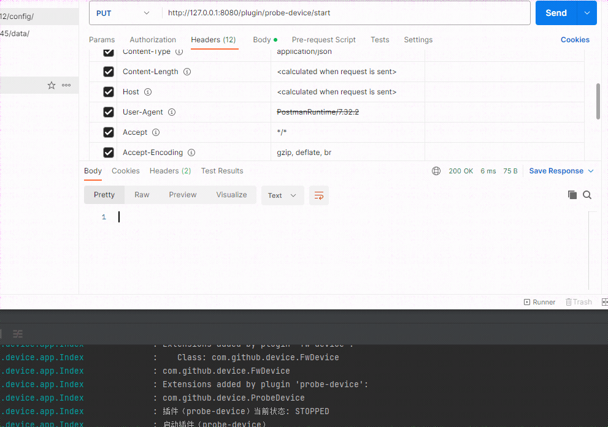
  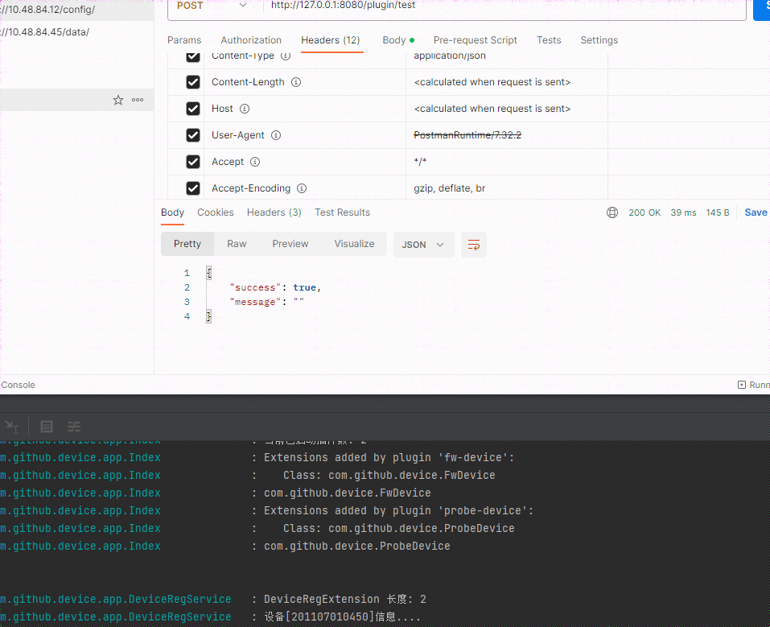
 

##### 自定义插件

- 新增模块

  ```
  <dependency>
      <groupId>org.pf4j</groupId>
      <artifactId>pf4j</artifactId>
      <version>3.9.0</version>
      <scope>provided</scope>
  </dependency>
  
  <dependency>
      <groupId>com.github.sxyy</groupId>
      <artifactId>device-plugin-api</artifactId>
      <version>1.0-SNAPSHOT</version>
      <scope>provided</scope>
  </dependency>
  
  需要指定插件的相关配置
  
  <!--插件id全局唯一-->
  <plugin.id>probe-device</plugin.id>
  <!--插件版本-->
  <plugin.version>0.10</plugin.version>
  <!--插件生命周期，不关注可以无-->
  <plugin.class>com.github.device.ProbeDevicePlugin</plugin.class>
  <!--插件提供者一-->
  <plugin.provider>beijing</plugin.provider>
  <!--插件描述-->
  <plugin.description>探针注册插件</plugin.description>
  <plugin.dependencies></plugin.dependencies>
  ```

- 插件扩展

  ```
  // 1.实现插件扩展点
  // 2.使用注解Extension 标记为扩展 
  @Extension
  public class ProbeDevice implements DeviceReg {
  
      private static final String PROBE = "probe";
  
      @Override
      public String deviceType() {
          return PROBE;
      }
  
      @Override
      public RegRequest extractRegRequest(Map<String, String> headers, byte[] body) {
          RegRequest request = new RegRequest();
          request.setDeviceType(PROBE);
          request.setDeviceNo("201107010450");
          Map<String, String> extra = new HashMap<>();
          extra.put("name", "探针");
          extra.put("version", "20201112_10.1.5.102902@release");
          request.setExtras(extra);
          return request;
      }
  }
  ```

- 配置打包

  ```
  <plugin>
                  <!-- 配置打包插件，一个是要将所有依赖包打包成一起，避免和其他包冲突，第二是要将插件信息写入到manifest.mf -->
                  <groupId>org.apache.maven.plugins</groupId>
                  <artifactId>maven-assembly-plugin</artifactId>
                  <version>3.1.0</version>
                  <configuration>
                      <descriptorRefs>
                          <descriptorRef>jar-with-dependencies</descriptorRef>
                      </descriptorRefs>
                      <attach>false</attach>
                      <archive>
                          <manifest>
                              <addDefaultImplementationEntries>true</addDefaultImplementationEntries>
                          </manifest>
                          <manifestEntries>
                              <Plugin-Id>${plugin.id}</Plugin-Id>
                              <Plugin-Version>${plugin.version}</Plugin-Version>
                              <Plugin-Provider>${plugin.provider}</Plugin-Provider>
                              <Plugin-Class>${plugin.class}</Plugin-Class>
                              <Plugin-Description>${plugin.description}</Plugin-Description>
                              <Plugin-Dependencies>${plugin.dependencies}</Plugin-Dependencies>
                          </manifestEntries>
                      </archive>
                  </configuration>
                  <executions>
                      <execution>
                          <id>make-assembly</id>
                          <phase>package</phase>
                          <goals>
                              <goal>single</goal>
                          </goals>
                      </execution>
                  </executions>
  </plugin>
  ```

  